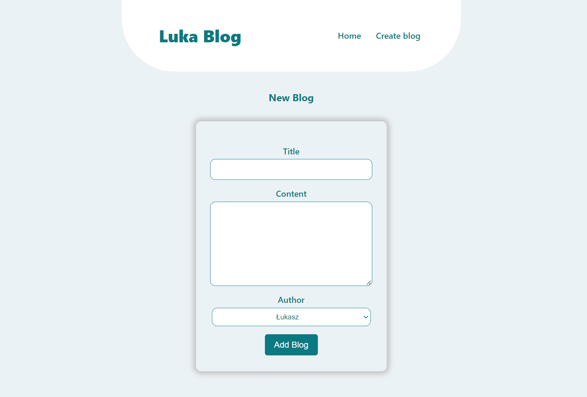
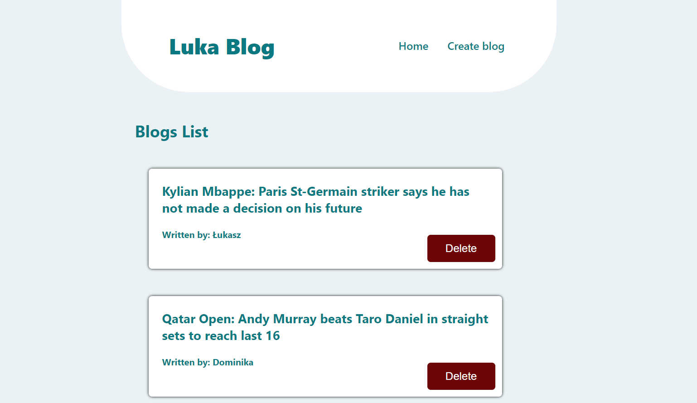

# Blog App

It's app when We are adding and deleting new posts. Everything work with .json file.
We have 3 pages: Home, Create Post and Post Details.

Technology in project:

-   React
-   React Router @6
-   Styled Components

# Images from project

